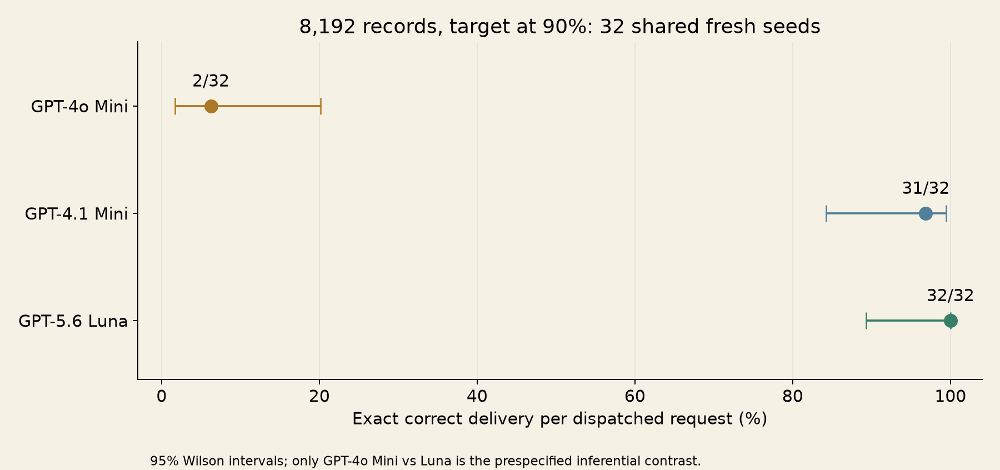
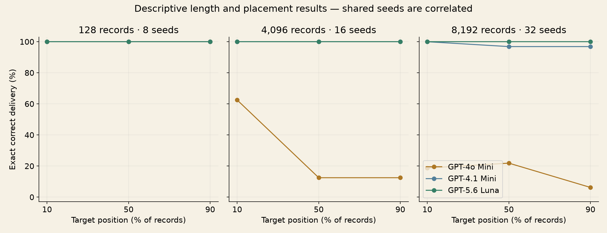

# AI vs the World’s Worst Filing Cabinet

Second edition · GPT Learning / ContextFrontier · 2026-09-09

In the prespecified 8,192-record, 90%-position comparison, GPT-4o Mini returned the exact correct answer in **2/32** requests and GPT-5.6 Luna in **32/32**. This is a comparison of configured systems on synthetic code retrieval, not a universal intelligence ranking.

The other central result is a measurement distinction: Claude Haiku often returned the correct final-line answer while failing the instruction to return only that answer. The paired reminder experiment measures that distinction prospectively.

[Protocol frozen before the new observations](PROTOCOL.md) · [Machine-readable analysis](summary.json) · [Independent case/token audit](case-and-token-audit.json)

## Primary comparison

| Model | Exact / dispatched | 95% Wilson interval | Actual input-token range |
|---|---:|---:|---:|
| GPT-4o Mini | 2/32 | 1.7%–20.1% | 111,280–111,649 |
| GPT-4.1 Mini | 31/32 | 84.3%–99.4% | 111,280–111,649 |
| GPT-5.6 Luna | 32/32 | 89.3%–100.0% | 111,279–111,648 |

The single prespecified paired contrast is GPT-4o Mini versus Luna: 32 complete pairs; old-only correct 0, Luna-only correct 30, both correct 2, both incorrect 0. Exact two-sided McNemar p = 1.862645149e-09. GPT-4.1 Mini is a descriptive comparator. No corrected significance claim is made for the other cells.



## Length and placement

Increasing length keeps the target fact and adds distractors from the same deterministic pool. Moving the target preserves the record set. Seeds recur across conditions, so length/position cells are correlated and must not be pooled as independent trials. Depth is record position, not token position.

| Model | Records | Target position | Exact / dispatched | Correct final line |
|---|---:|---:|---:|---:|
| Claude Haiku 4.5 | 128 | 10% | 4/4 | 4/4 |
| Claude Haiku 4.5 | 128 | 50% | 4/4 | 4/4 |
| Claude Haiku 4.5 | 128 | 90% | 4/4 | 4/4 |
| Claude Haiku 4.5 | 8,192 | 10% | 1/4 | 1/4 |
| Claude Haiku 4.5 | 8,192 | 50% | 1/4 | 1/4 |
| Claude Haiku 4.5 | 8,192 | 90% | 3/4 | 3/4 |
| GPT-4.1 Mini | 128 | 10% | 8/8 | 8/8 |
| GPT-4.1 Mini | 128 | 50% | 8/8 | 8/8 |
| GPT-4.1 Mini | 128 | 90% | 8/8 | 8/8 |
| GPT-4.1 Mini | 4,096 | 10% | 16/16 | 16/16 |
| GPT-4.1 Mini | 4,096 | 50% | 16/16 | 16/16 |
| GPT-4.1 Mini | 4,096 | 90% | 16/16 | 16/16 |
| GPT-4.1 Mini | 8,192 | 10% | 32/32 | 32/32 |
| GPT-4.1 Mini | 8,192 | 50% | 31/32 | 31/32 |
| GPT-4.1 Mini | 8,192 | 90% | 31/32 | 31/32 |
| GPT-4o Mini | 128 | 10% | 8/8 | 8/8 |
| GPT-4o Mini | 128 | 50% | 8/8 | 8/8 |
| GPT-4o Mini | 128 | 90% | 8/8 | 8/8 |
| GPT-4o Mini | 4,096 | 10% | 10/16 | 10/16 |
| GPT-4o Mini | 4,096 | 50% | 2/16 | 2/16 |
| GPT-4o Mini | 4,096 | 90% | 2/16 | 2/16 |
| GPT-4o Mini | 8,192 | 10% | 6/32 | 6/32 |
| GPT-4o Mini | 8,192 | 50% | 7/32 | 7/32 |
| GPT-4o Mini | 8,192 | 90% | 2/32 | 2/32 |
| GPT-5.6 Luna | 128 | 10% | 8/8 | 8/8 |
| GPT-5.6 Luna | 128 | 50% | 8/8 | 8/8 |
| GPT-5.6 Luna | 128 | 90% | 8/8 | 8/8 |
| GPT-5.6 Luna | 4,096 | 10% | 16/16 | 16/16 |
| GPT-5.6 Luna | 4,096 | 50% | 16/16 | 16/16 |
| GPT-5.6 Luna | 4,096 | 90% | 16/16 | 16/16 |
| GPT-5.6 Luna | 8,192 | 10% | 32/32 | 32/32 |
| GPT-5.6 Luna | 8,192 | 50% | 32/32 | 32/32 |
| GPT-5.6 Luna | 8,192 | 90% | 32/32 | 32/32 |



Claude has four seeds per position at 128 and 8,192 records. It did not receive the 4,096-record panel. Direct comparisons using Claude’s shared seeds are available under `shared_claude` in the JSON summary; do not compare unequal overall panels as a league table.

## Paired formatting intervention

For each model and task, 16 baseline/reminder pairs share the same records, expected answer, system instruction, and model settings. The sole added final sentence asks for only the code, one line, no explanation, labels, or Markdown. Max output is 2,048 for both conditions. Evidence positions are fixed at nominal 25% and 75%.

| Model | Task | Exact baseline → reminder | Final-line baseline → reminder | Exact improved / worsened |
|---|---|---:|---:|---:|
| GPT-4o Mini | two_hop | 0/16 → 0/16 | 0/16 → 0/16 | 0 / 0 |
| GPT-4o Mini | updates | 4/16 → 7/16 | 4/16 → 7/16 | 3 / 0 |
| GPT-4.1 Mini | two_hop | 13/16 → 11/16 | 16/16 → 16/16 | 0 / 2 |
| GPT-4.1 Mini | updates | 14/16 → 16/16 | 14/16 → 16/16 | 2 / 0 |
| GPT-5.6 Luna | two_hop | 14/16 → 12/16 | 14/16 → 12/16 | 0 / 2 |
| GPT-5.6 Luna | updates | 8/16 → 13/16 | 8/16 → 13/16 | 5 / 0 |
| Claude Haiku 4.5 | two_hop | 0/16 → 1/16 | 16/16 → 16/16 | 1 / 0 |
| Claude Haiku 4.5 | updates | 16/16 → 16/16 | 16/16 → 16/16 | 0 / 0 |

The final-line extractor was defined before this run. It examines only the last nonempty line, permits a narrow pair of backticks or bold markers, and requires a valid code or UNKNOWN. It never receives the answer key. This is not a general semantic grader. Strict exact delivery and final-line correctness answer different questions.

## Absent-key controls

| Model | Records | Exact / dispatched | Correct final line |
|---|---:|---:|---:|
| Claude Haiku 4.5 | 8,192 | 0/2 | 1/2 |
| GPT-4.1 Mini | 8,192 | 8/8 | 8/8 |
| GPT-4o Mini | 8,192 | 8/8 | 8/8 |
| GPT-5.6 Luna | 8,192 | 8/8 | 8/8 |

## Completion and token accounting

All 810 substantive dispatches are represented. Status counts: `{'completed': 810}`. The independent audit recomputed all 240 distinct answer keys directly from prompt records, checked every evidence span, and reconciled input/output counts with provider usage. Smoke checks are excluded from the scientific comparison.

| Model | Responses | Input tokens | Output tokens | Preflight → actual count delta range |
|---|---:|---:|---:|---:|
| GPT-4o Mini | 240 | 14,452,644 | 1,109 | [0, 0] |
| GPT-5.6 Luna | 240 | 14,452,404 | 2,272 | [0, 0] |
| GPT-4.1 Mini | 240 | 14,452,644 | 1,658 | [0, 0] |
| Claude Haiku 4.5 | 90 | 2,352,009 | 5,700 | [0, 0] |

OpenAI full-request counts use `/v1/responses/input_tokens`; Anthropic uses `/v1/messages/count_tokens`. Anthropic preflight is an estimate. The actual response usage is authoritative. Same text does not imply the same token count. K counts task symbols; it is never substituted for tokenizer units. The local legacy-inventory audit is a separate measurement, not a model-inference result.

## Planned and observed requests

| Stage | Planned | Observed | Skipped | Unobserved | Conservative cost bound |
|---|---:|---:|---:|---:|---:|
| v2-openai-main | 528 | 528 | 0 | 0 | $13.426843 |
| v2-claude-main | 26 | 26 | 0 | 0 | $2.722484 |
| v2-openai-format | 192 | 192 | 0 | 0 | $0.128495 |
| v2-claude-format | 64 | 64 | 0 | 0 | $0.246028 |

Costs conservatively charge all input at 1.25× ordinary uncached input price and actual output at the listed price. These are planning bounds, not invoices; cached-input discounts are not assumed. Speech and transcription reservations are reported separately in `production-audit.json`. Fresh total caps are $20 OpenAI, including production, and $5 Anthropic, using Haiku only. No uncertain request was automatically retried.

## Model profiles and sources

- GPT-4o Mini: `gpt-4o-mini-2024-07-18`, temperature 0; [official profile and pricing](https://developers.openai.com/api/docs/models/gpt-4o-mini).
- GPT-4.1 Mini: `gpt-4.1-mini-2025-04-14`, temperature 0; [official profile and pricing](https://developers.openai.com/api/docs/models/gpt-4.1-mini).
- GPT-5.6 Luna: `gpt-5.6-luna`, reasoning none, provider default sampling; [official profile and pricing](https://developers.openai.com/api/docs/models/gpt-5.6-luna).
- Claude Haiku 4.5: `claude-haiku-4-5-20251001`, temperature 0; [official Claude model overview](https://platform.claude.com/docs/en/models/overview).
- The film uses disclosed stock Cedar and Onyx voices; [official speech documentation](https://developers.openai.com/api/docs/guides/text-to-speech).

Sources checked on 2026-09-09. Full model parameters and configured prices are preserved in each run manifest. This edition did not increase tested-model reasoning settings. The user requested more thought and craft in the production.

## Limits and relation to edition one

This controlled nonsense-code workload is not representative of all natural documents. The experiments measure delivered task answers, not internal attention weights, intelligence, or a reliable universal context frontier. Configurations differ in sampling and may use model aliases; returned model IDs are preserved. No mechanistic or isolated model-age effect is claimed.

Edition-one data remain unchanged and are not pooled here. The new generator preserves target facts and distractor prefixes across lengths; it is a fresh test under a revised protocol. Its primary condition uses 32 fresh seeds, rather than the earlier exploratory eight-case check. Refusals, output limits, and uncertain transport outcomes must be disclosed separately if they occur; they must never be called proven memory failures.

## Reproduce

```sh
python -m scripts.analyze_v2
python -m scripts.report_v2
python -m video.v2.story
python -m video.v2.speech  # paid only for uncached clips
python -m video.v2.audio --clip-qa  # paid transcription only if uncached
python -m video.v2.render
python -m video.v2.verify
```

Use the evidence archive to populate the original `results/v2-*` directories. Rendering uses local cached audio, macOS fonts, Pillow, NumPy, and FFmpeg; see `video/v2/README.md`. Never rerun paid experiments solely to rebuild the film.
